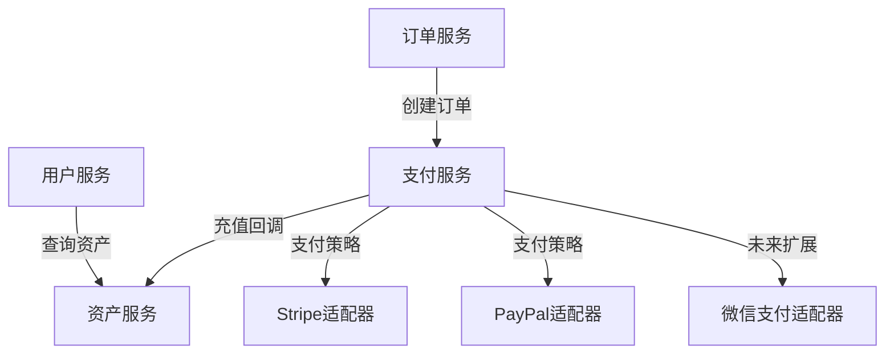

# 会员充值订单支付模块需求文档  

## 1. 项目概述  
**核心业务**：为系统提供会员使用时间充值服务，用户可选择预设套餐或自定义时长，支付成功后实时到账。  

**业务规则**：  
- **基础套餐**（后台可配置）：  
  | 使用时间 | 价格(USD) | 折扣率 |  
  |----------|-----------|--------|  
  | 1小时    | $1.00     | -      |  
  | 10小时   | $9.00     | 10%    |  
  | 15小时   | $12.00    | 20%    |  
  | 30小时   | $24.00    | 20%    |  
- 支持自定义时长（1-100小时），价格按公式计算：`金额 = 时长 × 基础单价 × 折扣系数`  
- 充值成功后实时更新用户资产（可查剩余时长）  
- **当前支持支付渠道**：Stripe、PayPal（国际版）  
- **未来扩展**：微信/支付宝（国内）、多币种支持、微服务架构  

---

## 2. 用户角色与用例  
| **角色**       | **用例**                  | **详细说明**                                                                 |
|----------------|--------------------------|-----------------------------------------------------------------------------|
| 终端用户       | 选择充值套餐             | 查看套餐折扣信息，选择预设套餐或自定义时长                                  |
|                | 完成支付                 | 通过Stripe/PayPal完成支付流程                                               |
|                | 查看资产变更             | 支付成功后实时查看剩余时间增加                                              |
| 商家管理员     | 管理充值套餐             | 配置套餐时长、价格、折扣标签                                                |
|                | 监控充值记录             | 查看充值订单、成功/失败率、各套餐销售占比                                   |
|                | 处理异常订单             | 对支付成功但未到账的订单手动补发时长                                        |
| 系统           | 自动更新资产             | 支付回调成功后实时增加用户剩余时长                                          |
|                | 定时对账任务             | 每日凌晨对比系统订单与支付平台数据                                          |

---

## 3. 功能需求  

### 3.1 用户端功能  
| **功能**               | **详细说明**                                                                 | **优先级** |
|------------------------|-----------------------------------------------------------------------------|------------|
| 套餐展示               | 卡片式布局展示套餐，突显折扣信息（如"省$1!"）                              | P0         |
| 自定义充值             | "其他时长"按钮展开自定义输入框（1~100小时）                                | P1         |
| 实时价格计算器         | 自定义输入时自动计算金额（基于公式）                                       | P1         |
| 资产实时展示           | 页面顶部常显当前剩余时长（格式：XX小时XX分钟）                             | P0         |
| 支付结果联动           | 支付成功后弹窗显示新到账时长，资产数字滚动更新                             | P0         |
| 支付记录查询           | 用户查看自己的充值历史记录（时间、金额、获得时长）                         | P2         |

### 3.2 管理端功能  
| **功能**               | **详细说明**                                                                 | **优先级** |
|------------------------|-----------------------------------------------------------------------------|------------|
| 套餐管理               | CRUD操作：时长、价格、折扣标签、启用状态                                   | P0         |
| 充值记录查询           | 按用户ID/订单状态/支付渠道/时间范围筛选                                    | P1         |
| 资产监控面板           | 实时图表展示：每日充值总量（小时）、各套餐销售占比、失败订单分布           | P2         |
| 支付渠道配置           | 配置Stripe/PayPal的API密钥、启用状态、回调地址                             | P0         |
| 异常订单处理           | 手动补发时长功能（需审核日志）                                             | P1         |

### 3.3 支付流程  
```mermaid
sequenceDiagram
    participant 用户
    participant 前端
    participant 后端
    participant 支付网关
    participant 资产服务
    
    用户->>前端： 选择"5小时套餐"($4)
    前端->>后端： 提交充值订单(5小时,$4)
    后端->>后端： 1. 生成订单号#TX2025<br>2. 记录订单状态(pending)
    后端-->>前端： 返回支付凭据(client_secret)
    前端->>支付网关： 调用支付表单(Stripe)
    支付网关-->>后端： 支付成功回调(带签名)
    后端->>后端： 1. 验签<br>2. 验证金额匹配
    后端->>资产服务： 调用addHours(用户ID, 300分钟)
    资产服务->>资产服务： 原子更新：<br>remaining = remaining + 300<br>total_hours = total_hours + 5
    资产服务-->>后端： 返回新余额(32小时)
    后端->>后端： 1. 更新订单状态(success)<br>2. 记录充值流水
    后端-->>前端： WebSocket推送支付结果
    前端->>用户： 显示"充值成功！余额：32小时"
```

---

## 4. 数据库设计  

## 5. 关键接口定义  

## 6. 配置管理  
### 套餐管理界面功能：  
- 增删改查充值套餐（时长、价格、折扣标签）  
- 实时计算并显示折扣率：`(1 - (套餐价 / (时长 × 基础单价))) × 100`  
- 启用/停用套餐开关  

### 支付渠道配置：  
| 参数          | Stripe          | PayPal         |
|---------------|-----------------|----------------|
| API密钥       | sk_test_xxx     | client_id_xxx  |
| Webhook密钥   | whsec_xxx       | 无需           |
| 回调URL       | /callback/stripe| /callback/paypal|

---

## 7. 安全与容错机制  
| **风险场景**       | **解决方案**                                                                 |
|--------------------|-----------------------------------------------------------------------------|
| 重复支付           | 订单状态机校验（pending→success），Redis分布式锁控制                        |
| 支付金额篡改       | 回调时校验第三方支付金额与订单金额匹配                                      |
| 资产更新失败       | 失败订单进入补偿队列，每5分钟重试（最多3次）                                |
| 高并发资产更新     | Redis原子操作：`INCRBY user:123:minutes 300` + 异步持久化到DB               |
| 回调攻击           | 严格签名验证 + IP白名单（支付网关IP）                                       |
| 套餐配置误操作     | 操作审计日志 + 变更前二次确认                                               |

---

## 8. 扩展性设计  

### 8.1 支付策略扩展  
```java
// 支付策略接口
public interface PayStrategy {
    PayResult execute(PayRequest request);
}

// Stripe支付实现
@Service("stripePayStrategy")
public class StripePayStrategy implements PayStrategy {
    public PayResult execute(PayRequest request) {
        // 调用Stripe SDK
    }
}

// 未来扩展微信支付
@Service("wechatPayStrategy")
public class WechatPayStrategy implements PayStrategy {
    // 国内支付实现
}
```

### 8.2 微服务化预留方案  


### 8.3 自定义定价引擎  
```java
// 可配置的价格计算规则
public BigDecimal calculateCustomPrice(int hours) {
    // 基础单价（从配置读取）
    BigDecimal basePrice = configService.getBasePrice(); 
    
    // 折扣规则（从DB读取）
    List<DiscountRule> rules = discountRuleDao.getRules();
    
    // 应用规则（如：满10小时打8折）
    for (DiscountRule rule : rules) {
        if (hours >= rule.getMinHours()) {
            return basePrice.multiply(hours).multiply(rule.getDiscount());
        }
    }
    return basePrice.multiply(hours);
}
```

---

## 9. 未来扩展计划  
1. **阶段一（国内支付）**  
   - 增加微信/支付宝支付策略  
   - 适配人民币(CNY)结算  
   - 国内支付证书管理界面  

2. **阶段二（微服务化）**  
   ```mermaid
   graph LR
     A[网关层] --> B[用户服务]
     A --> C[订单服务]
     A --> D[支付服务]
     A --> E[资产服务]
     D --> F[支付网关集群]
   ```

3. **阶段三（高级功能）**  
   - 多币种自动汇率转换  


**交付物清单**：  
1. `数据库变更脚本.sql` - 包含表结构及初始套餐数据  
2. `支付服务核心代码` - Java后端模块  
3. `前端充值组件` - Vue实现套餐展示/支付流程  
4. `配置指南` - 支付渠道配置说明  
5. `测试用例集` - 包含支付全流程测试案例  
