:::tip
不会使用某个功能时可以将鼠标悬浮在对应功能标题后的`?`获取帮助  
项目名称前带`*`的表示该项为必填项  
:::

# 软件管理
登录后台，点击左侧菜单`软件管理`，进入软件列表页面，点击`新增`按钮。  

可以看到，软件配置分为`基本信息`、`通信安全`、`绑定设置`、`限开设置`、`试用设置`几个模块，下面我们一一讲解。
## 1、基本信息
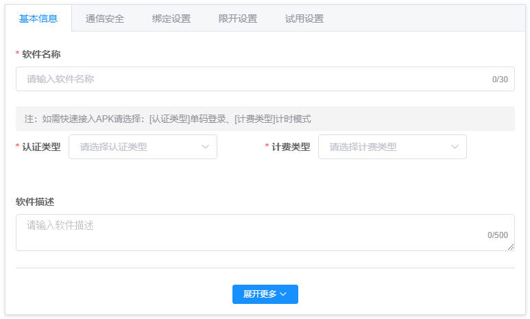
- **\*软件名称**：软件的名称，如果使用快速接入功能此名称会在软件的登录框显示，Windows软件和安卓软件登录框分别如下：  
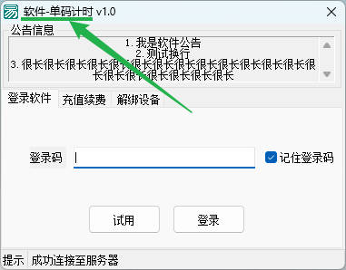 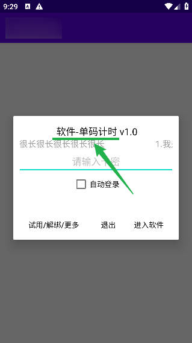

- **\*认证类型**
  - 账号登录：用户需要首先注册登录账号后，使用账号和密码的方式登录。
  - 单码登录：仅使用单个登录码进行登录。

- **\*计费类型**
  - 计时模式：用户在有效时间范围内可无限次使用。
  - 计点模式：按账户剩余的点数进行控制，当点数小于等于0时，用户将无法继续使用。

::: tip
注：如需快速接入成品安卓软件(APK)请选择：`认证类型`为**单码登录**、`计费类型`为**计时模式**，其他模式暂不支持快速接入。
:::

::: details 更多设置项（非必填项或默认配置项）
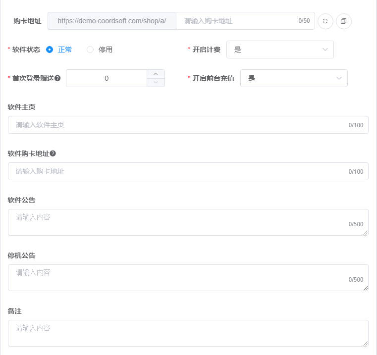
- **购卡地址**：自定义该软件的商城地址，设置后访问该地址将只显示该软件的商品信息供客户购买，后面两个按钮分别为随机生成及复制链接。
- **软件状态**：停用后用户无法登录和使用该软件。停用后在线用户也会被强制退出系统(退出速度根据[心跳配置](#heartbeat))。
- **开启计费**：是否开启计费模式，关闭后用户使用过期的账号或卡密也可登录软件。
- **首次登录赠送**：首次登录赠送的免费额度，默认为0，如果软件为计时模式，则此处代表赠送的时长，单位为秒；如果软件为计点模式，则此处代表赠送的点数。
- **开启前台充值**：是否开启网页端充值功能，关闭后在网页端将不再列出该软件的充值选项，见下图红框位置，软件上的充值功能不受影响。
  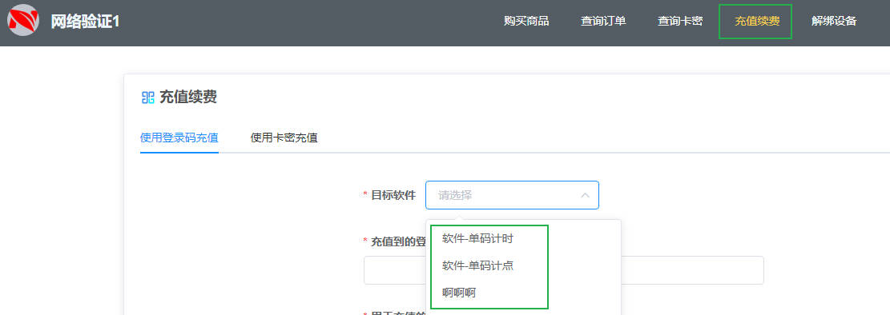
- **软件主页**：使用场景：您有自己的软件官网或交流论坛，可将链接填写在此处，供用户点击跳转了解软件详情及用法。
- **购卡地址**：使用场景：您有自己的店铺或商品链接，可将店铺链接填写在此处，供用户点击跳转到您的店铺下单。
- **软件公告/停机公告**：软件的公告信息，如果使用快速接入功能此信息会在软件的登录框显示，Windows软件和安卓软件登录框分别如下：
  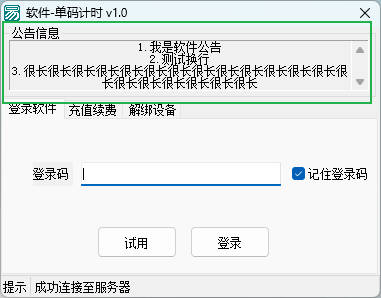 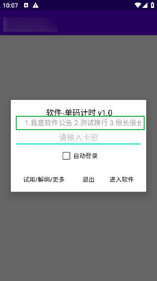
- **备注**：备注信息。  
:::

## 2、通信安全
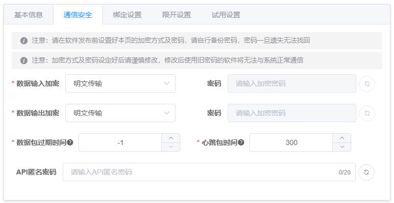  
::: warning 注意
请在软件发布前设置好本页的加密方式及密码，请自行备份密码，密码一旦遗失无法找回  
加密方式及密码设定好后请谨慎修改，修改后使用旧密码的软件将无法与系统正常通信
:::

> 数据输入：从软件端到验证后台的数据传输。  
> 数据输出：从验证后台返回给软件端的数据传输。

- **数据输入加密**：软件-->后台：加密方式分为以下三种：
  - 明文传输：安全性极低，仅建议开发阶段使用，方便开发者查看与调试数据，无需提供密码。
  - BASE64：安全性较低，无需提供密码。
  - AES增强算法：安全性较高，建议对外发布的软件选择此加密方式，需要提供密码。
- **数据输出加密**：后台-->软件：加密方式同上。
- **数据包过期时间**：校验软件端到后台端的时间差，当差值大于设定值时，后台将认为该数据为非法数据而拒绝接收，单位为秒，默认为-1不限制。
- **心跳包时间**：单位为秒，软件端若在设定时间内无任何操作将自动下线，-1为不检测，默认为300秒，如果设定为-1，软件将不会自动下线。
::: tip
- 心跳时间即为用户软件与验证后台的交互周期，如果用户软件与后台通信时，后台未收到心跳包，则认为用户已下线，此时后台将强制用户下线，如果设定为-1，则不会强制用户下线。
- 当后台主动踢掉用户时，后台将立即强制用户下线，但由于心跳周期的存在，用户可能在收到强制下线通知前，用户仍可继续使用软件，最长等待一个心跳周期后，用户将无法继续使用软件。
:::
- **API匿名密码**：如果设定此密码，软件端与后台通信时将使用密文作为API名称。

## 3、绑定设置
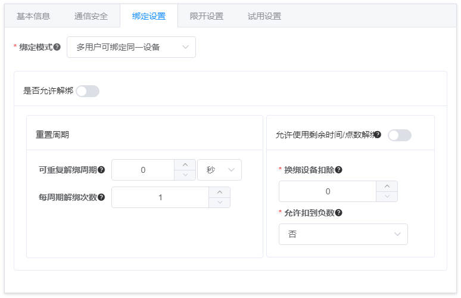

> 此处的`用户`指卡密/单码，每一张卡密/单码视为一个用户

- **绑定模式**：
  - 不绑定/无限制：卡密和设备可随意更换，没有任何限制。
  - 用户与设备一对一绑定：卡密和设备都不能更换，比如卡密123与设备A进行了绑定，那么卡密123只能在设备A上登录，无法在设备B上登录，设备A也只能使用卡密123进行登录，不能使用卡密456进行登录。
  - 一用户可绑定多个设备：同一卡密可更换设备，但设备不能更换卡密，比如卡密123与设备A进行了绑定，那么卡密123除了能在设备A上登录，也可以在设备B上登录，但设备A只能使用卡密123进行登录，不能使用卡密456进行登录，设备B也只能使用卡密123进行登录，不能使用卡密456进行登录。
  - 多用户可绑定同一设备【默认，推荐：大多数人的需求】：同一设备可更换卡密，但卡密不能更换设备，比如卡密123与设备A进行了绑定，那么卡密123只能在设备A上登录，无法在设备B上登录，设备A可以使用卡密123进行登录，也可以使用卡密456进行登录。

> 如果没有想明白此功能各个选项的区别，请保持默认选项【多用户可绑定同一设备】。

- **是否允许解绑**：是否开启解绑功能，解绑功能为否时，用户将无法解绑设备，解绑功能为是时，用户将可以解绑设备，默认为否。
- **重置周期**：
  - **可重复解绑周期**：每个用户重置解绑次数的时间周期，比如设置为2天，则同一用户每2天可解绑一次，整数，0为不重置，默认为0，最小生效周期为1分钟
  - **每周期解绑次数**：每周期可解绑次数，整数，默认为1。用户解绑时优先扣除解绑次数，当解绑次数为0时，将根据`允许使用剩余时间/点数解绑`来决定是否可以继续解绑，修改后新用户会立即生效，已有用户新周期生效。
- **允许使用剩余时间/点数解绑**：解绑时优先扣除解绑次数，当解绑次数为0时，将根据本选项来决定是否可以继续解绑，如果为否，用户将无法继续解绑，如果为是，系统将根据下方配置扣除对应时间/点数。
  - **换绑设备扣除**：用户解绑时换绑设备扣减时间或点数，单位秒或点。
  - **允许扣到负数**：用户换绑设备扣减时间或点数，是否允许用户过期(计时模式)或点数为负数(计点模式)，一旦用户过期或点数为负数后无法再次解绑。（只能负一次）

> 管理员在后台可以在`软件用户管理`中为用户解绑设备，此时不会扣除用户的解绑次数。

## 4、限开设置
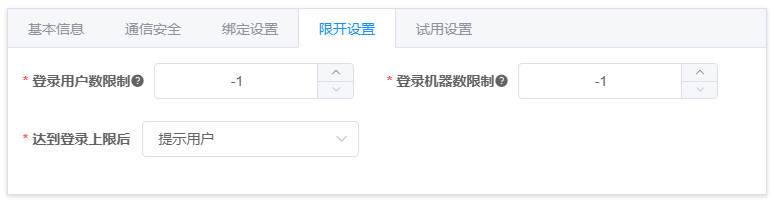

> 此处的`用户`指卡密/单码，每一张卡密/单码视为一个用户

- **登录用户数限制**：同一张卡密可同时在线数量，根据token进行统计。
- **登录设备数限制**：同一张卡密可同时在线设备数量，根据设备码进行统计，相同设备码视为1个设备。
- **达到登录上限后**：
  - 提示用户：后登录的用户需等待先登录的用户下线后才可以登录。
  - 注销最早登录的用户：后登录的用户无需等待，但先登录的用户将被顶号下线(退出速度根据[心跳配置](#heartbeat))。

## 5、试用设置
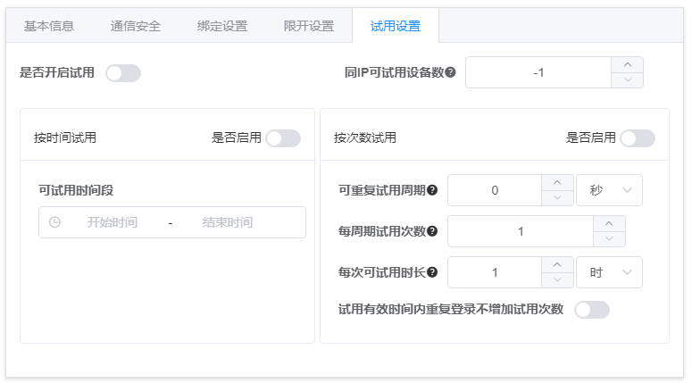

- **是否开启试用**：是否开启试用功能，默认为否。开启后用户可通过试用API或者快速接入的登录框登录软件，无需注册账号或购买卡密。Windows软件和安卓软件登录框分别如下：  
  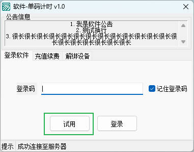  
  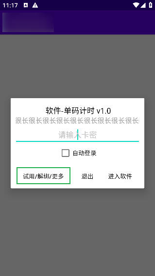 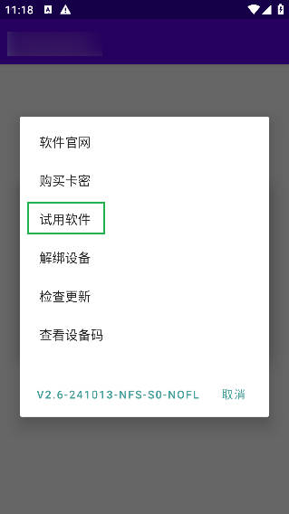

- **同IP可试用设备数**：每个IP可试用设备数，整数，比如设置为3，则相同IP的3台设备(比如同一局域网内)可各试用一次，-1为不限制，默认为-1。
- **按时间试用**：按特定时间段试用，比如每天的0点到5点之间可试用。
- **按次数试用**：指定试用次数，可周期性重置，比如每天最多试用5次，重置周期为1天，则每天可试用5次，以此类推。
  - **可重复试用周期**：每个设备重置试用次数的时间周期，比如设置为2天，则同一设备每2天可试用一次，整数，0为不重置，默认为0，最小生效周期为1分钟。
  - **每周期试用次数**：每周期可试用次数，整数，默认为1。
  - **每次可试用时长**：每次可试用时长，整数，默认为1小时。
  - **试用有效时间内重复登录不增加试用次数**：建议开启，可有效避免由用户电脑死机、网络中断等导致的软件端意外退出浪费试用次数的情况。

## 6、软件接口
登录后台，点击左侧菜单`软件管理`，进入软件列表页面。在此页面可以看到系统中已经创建的所有软件。
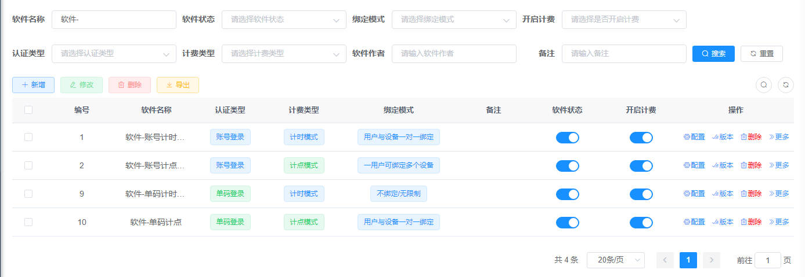

点击软件对应右侧的`配置`按钮，可进入该软件详情页面以及修改软件配置。  
可以看到，软件配置分为基本信息、通信安全、绑定设置、限开设置、试用设置、接口信息、API匿名信息几个模块，其中，接口信息和API匿名信息为新建软件时所没有的，在这里补充说明下，其余模块请参考[添加软件](#app)。

### 1、接口信息
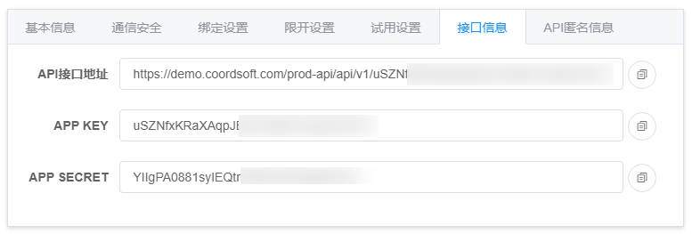  
接口信息用于开发软件时软件端与后台进行通信的API接口及密钥，该信息在软件创建时由系统自动生成，无法更改。

### 2、API匿名信息
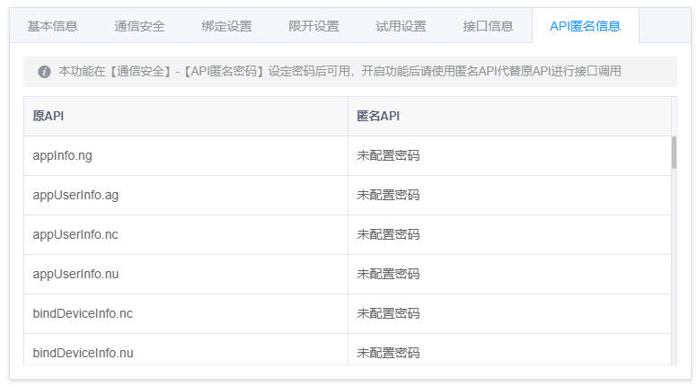   
如果在`通信安全`模块中设置了`API匿名密码`，则此处会显示原API与匿名API的对应信息。

## 7、其他操作
- **版本**：可进入该软件的软件版本管理页面，管理软件版本，支持添加、删除、编辑版本信息，同时支持批量删除版本。
- **删除**：删除软件，删除软件后，该软件下的所有软件用户将不可登录，请谨慎操作。
- **更多**：
  - **用户管理**：可进入该软件的软件用户管理页面，管理软件用户，支持添加、删除、编辑用户信息，同时支持批量冻结、解冻、删除用户。
  - **卡类管理**：可进入该软件的卡类管理页面，管理软件卡类，支持添加、删除、编辑卡类信息，同时支持快速新增卡类。
  - **卡密管理**：可进入该软件的卡密管理页面，管理软件卡密，支持添加、删除、编辑卡密信息，同时支持批量生成卡密。
