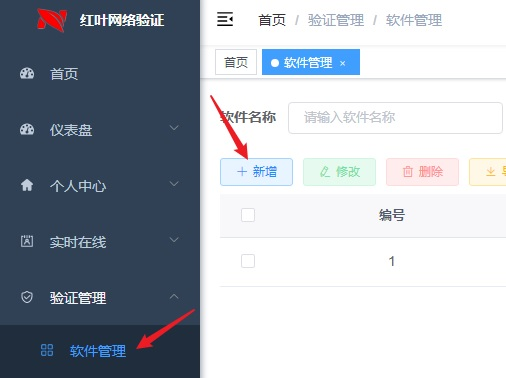
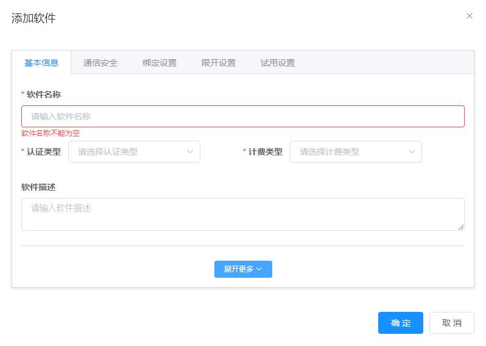
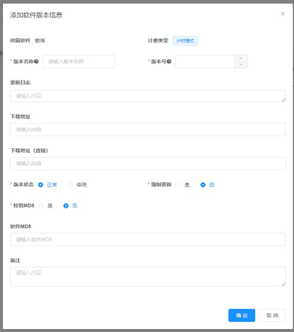
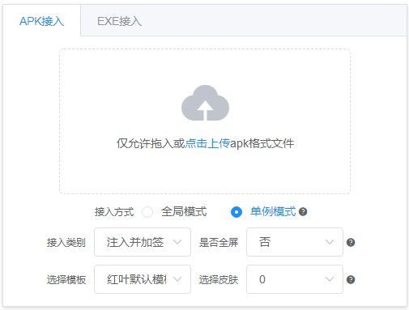
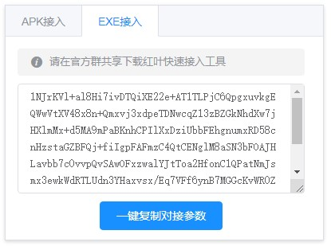
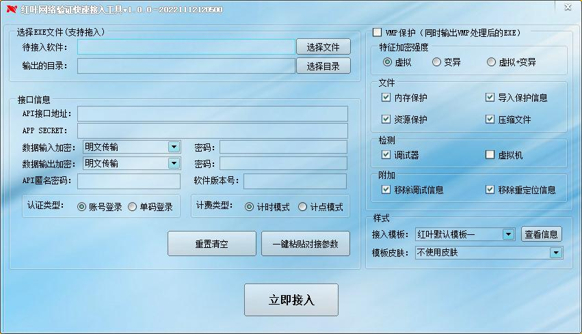

# 快速上手  

:::tip
不会使用某个功能时可以将鼠标悬浮在对应功能标题后的`?`获取帮助  
项目名称前带`*`的表示该项为必填项  
:::

## 一、数据准备  
### 1、新建软件  
找到侧边栏的验证管理下的软件管理并点击进入，点击`新增`按钮。  
  
  
- **\*软件名称**：软件的名称，如果使用快速接入功能此名称会在软件的登录框显示  
- **\*认证类型**  
  - 账号登录：用户需要首先注册账号设置密码后，使用账号和密码的方式登录。  
  - 单码登录：仅使用单个登录码进行登录。  
- **\*计费类型**  
  - 计时模式：用户在有效时间范围内可无限次使用。  
  - 计点模式：按账户剩余的点数进行控制，当点数小于等于0时，用户将无法继续使用。 
::: details 更多设置项（非必填项或默认配置项）  
##### 基本信息  
- **软件状态**：停用后用户无法登录和使用该软件。停用后在线用户也会被强制退出系统。  
- **首次登录赠送**：首次登录赠送的免费额度，默认为0，如果软件为计时模式，则此处代表赠送的时长，单位为秒；如果软件为计点模式，则此处代表赠送的点数。  
- **软件公告/停机公告**：软件的公告信息，如果使用快速接入功能此信息会在软件的登录框显示。  
- **软件主页**：使用场景：您有自己的软件官网或交流论坛，可将链接填写在此处，供用户点击跳转了解软件详情及用法。  
- **购卡地址**：使用场景：您有自己的店铺或商品链接，可将店铺链接填写在此处，供用户点击跳转到您的店铺下单。  
- **备注**：备注信息。  
##### 通信安全  
> 数据输入：从软件端到验证后台的数据传输。  
> 数据输出：从验证后台返回给软件端的数据传输。  

- **数据输入加密**：  
  - 明文传输：安全性极低，仅建议开发阶段使用，方便开发者查看与调试数据，无需提供密码。  
  - BASE64：安全性较低，无需提供密码。  
  - AES：安全性较高，建议对外发布的软件选择此加密方式，需要提供密码。  
- **数据包过期时间**：校验软件端到后台端的时间差，当差值大于设定值时，后台将认为该数据为非法数据。  
- **心跳包时间**：单位为秒，软件端若在设定时间内无任何操作将自动下线，-1为不检测，默认为300秒。  
- **API匿名密码**：如果设定此密码，软件端与后台通信时将使用密文作为API名称。  
##### 绑定设置：用户绑定及解绑设备相关设置  
> 此处的`用户`指卡密，每一张卡密视为一个用户  

- **绑定模式**：  
  - 不绑定/无限制：卡密和设备可随意更换，没有任何限制。  
  - 用户与设备一对一绑定：卡密和设备都不能更换，比如卡密1与设备1进行了绑定，那么卡密1只能在设备1上登录，无法在设备2上登录，设备1也只能使用卡密1进行登录，不能使用卡密2进行登录。  
  - 一用户可绑定多个设备：同一卡密可更换设备，但设备不能更换卡密，比如卡密1与设备1进行了绑定，那么卡密1除了能在设备1上登录，也可以在设备2上登录，但设备1只能使用卡密1进行登录，设备2也只能使用卡密1进行登录。  
  - 多用户可绑定同一设备：同一设备可更换卡密，但卡密不能更换设备，比如卡密1与设备1进行了绑定，那么卡密1只能在设备1上登录，无法在设备2上登录，设备1可以使用卡密1进行登录，也可以使用卡密2进行登录。  

- **限制解绑次数**：解绑时优先扣除解绑次数，当解绑次数为0时，将根据[使用余额解绑]来决定是否可以继续解绑，修改后新用户会生效，已有用户不生效。  
- **使用余额解绑**：解绑时优先扣除解绑次数，当解绑次数为0时，将根据本选项来决定是否可以继续解绑，如果为否，用户将无法继续解绑，如果为是，系统将根据下方配置扣除对应余额。  

##### 限开设置：限制同一用户下可同时在线软件端数量  
> 此处的`用户`指卡密，每一张卡密视为一个用户  

- **登录用户数限制**：同一张卡密可同时在线数量，根据token计算。  
- **登录设备数限制**：同一张卡密可同时在线设备数量，根据设备码进行计算，相同设备码视为1个设备。  
- **达到登录上限后**：  
  - 提示用户：后登录的用户需等待先登录的用户下线后才可以登录。  
  - 注销最早登录的用户：后登录的用户无需等待，但先登录的用户将被顶号下线。  

##### 试用设置  
> 建议：打开`试用有效时间内重复登录不增加试用次数`，为了避免有电脑死机、网络中断等导致的软件端意外退出浪费试用次数。  
:::

### 2、新建软件版本  
:::tip
提示：如果需要更新版本时请新建一个版本，并设置一个更大的版本号即可，而不要修改或删除已有的版本，如果版本被删除，那么对应版本的软件将无法使用。  
:::

找到新建的软件条目，点击右侧版本按钮，可进入版本管理，点击`新增`添加软件版本信息。  
  
- **\*版本名称**：版本名称可随意填写，如测试版v1.0、正式版2.0、国庆特别版等，用于软件显示，如果使用快速接入功能此名称会在软件的登录框显示  
- **\*版本号**：版本号用于升级，只限填写整数，同一软件版本号不可重复，版本越新，数字应该越大，建议使用发布时间，如20220101  
::: details 更多设置项（非必填项或默认配置项）  
- **下载链接**：填写内容应为软件的下载网站链接，如有更新时，用户点击更新按钮后将使用浏览器跳转到该地址。  
- **下载地址（直链）**：填写内容为新版本的软件的直链链接，如有更新时，用户点击更新按钮后将启动APK内置的下载器进行下载，下载完毕后将尝试启动安装。  
:::tip
下载链接和下载地址（直链）至少选择一个填写，如果同时填写则直链生效。如果都不填写将导致更新异常。  
:::

## 二、快速接入/一键接入/成品接入  
本系统提供快速接入功能，又可称为一键接入、成品接入等，本功能主要用于开发者临时接单需要快速接入快速测试的场景，接入软件建议小于20M，目前可支持`全部模式`的电脑软件(EXE)接入与`单码计时`模式的安卓软件(APK)接入。  
:::tip
快速接入安全性较低，建议接入后自行加固或加壳后再对外发布。  
:::

### 1、安卓软件(APK)快速接入  
点击新建的软件版本条目后面的快速接入按钮，选择APK接入并拖入APK文件。  
  
- **接入方式**：  
  - 全局模式：全局模式为全自动注入模式，无需人工操作。  
  - 单例模式：单例模式为半自动注入模式，需指定要注入的Activity和Method。  
:::tip
<a href='/guide/qa/qa.html#%E5%8D%95%E4%BE%8B%E6%B3%A8%E5%85%A5%E7%9A%84activity%E5%92%8Cmethod%E5%BA%94%E8%AF%A5%E5%A6%82%E4%BD%95%E9%80%89%E6%8B%A9'>点此查看Activity和Method该如何选择</a>
:::  
- **接入类别**：  
  - 注入并加签：自动将上传的APK对接到当前系统并自动为APK签名。相当于下方的注入与加签两步合并在一起。  
  - 仅注入：自动将上传的APK对接到当前系统。如果想正常使用需要用户自行加签。  
  - 仅加签：自动将上传的APK进行加签。使用加固工具加固完APK后可使用此选项为APK加签。  
:::tip
提示：APK只有签名后才能被设备安装使用。
:::  

### 2、电脑软件(EXE)快速接入  
点击新建的软件版本条目后面的快速接入按钮，选择EXE接入，点击EXE接入下方的`一键复制对接参数`。  
  
在官方群共享下载**最新版本**的`红叶快速接入工具`后打开，选择要对接的软件和输出文件保存目录。  
  
点击快速接入工具的`一键粘贴对接参数`即可自动填写相关参数。  
点击`立即接入`按钮即可将软件一键对接到当前系统。  

## 三、代码编程接入  
### 1、下载SDK和例程  
可在官方群共享下载对应语言的SDK和对应例程，目前提供有易语言、按键精灵(安卓)、懒人精灵、火山PC的相关例程。  
### 2、修改对接参数  
进入系统后台`验证管理`-`软件管理`，点击软件右侧的`配置`按钮找到接口信息，将例程中的初始化函数修改为与后台一致即可对接成功。  