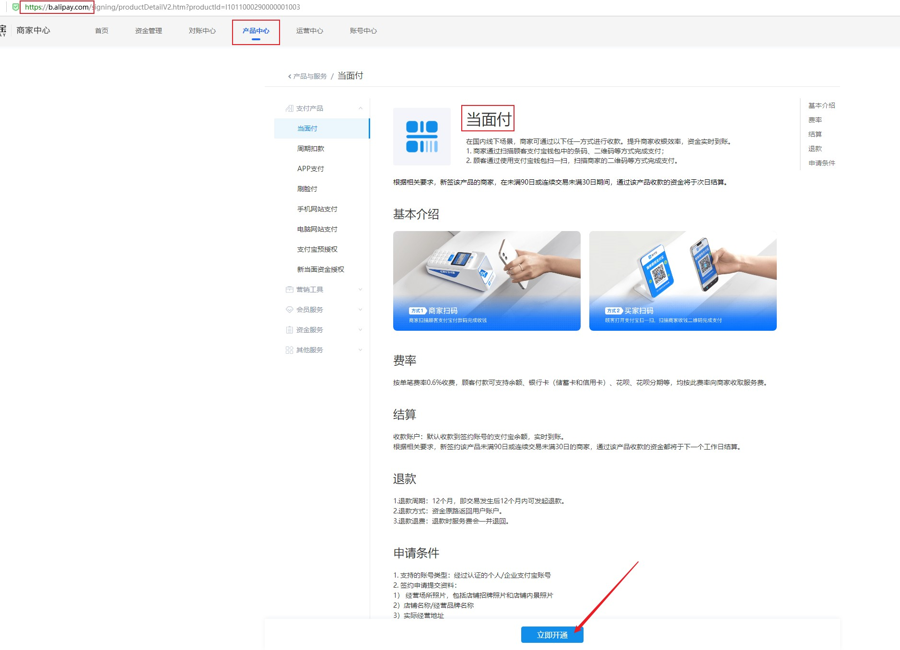
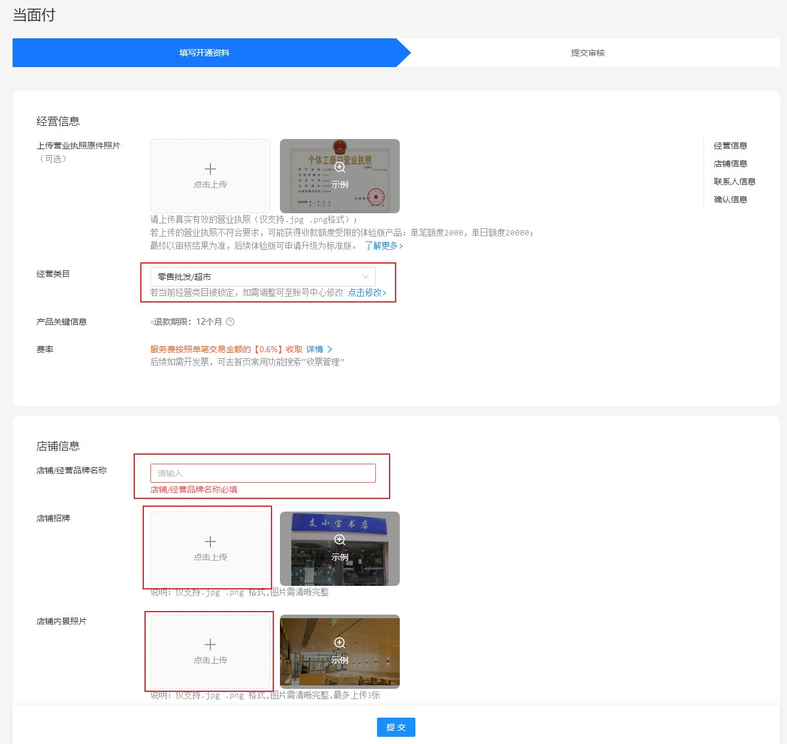
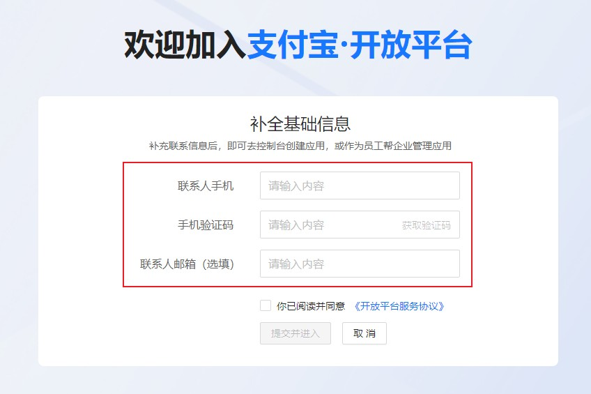
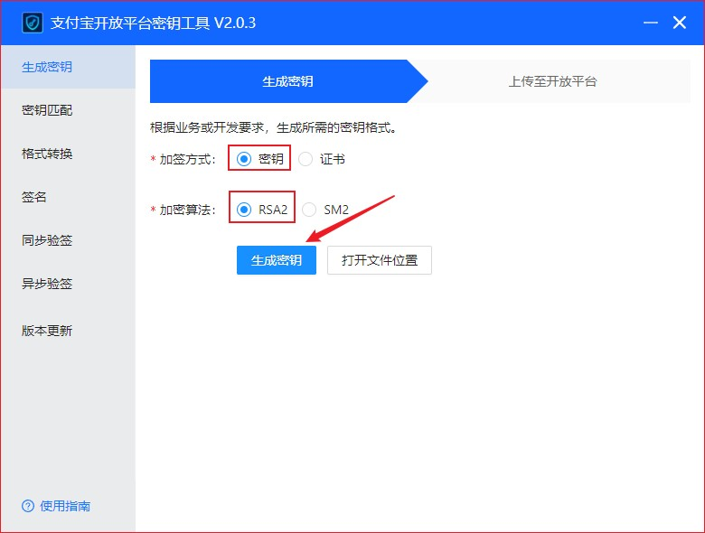
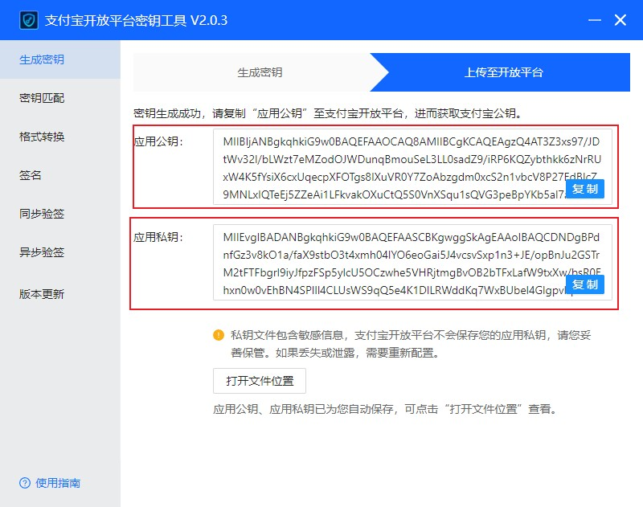
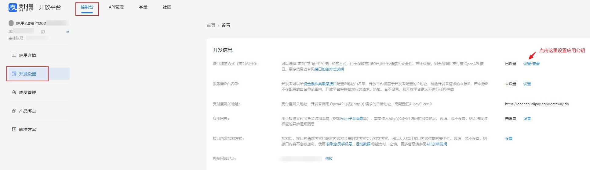
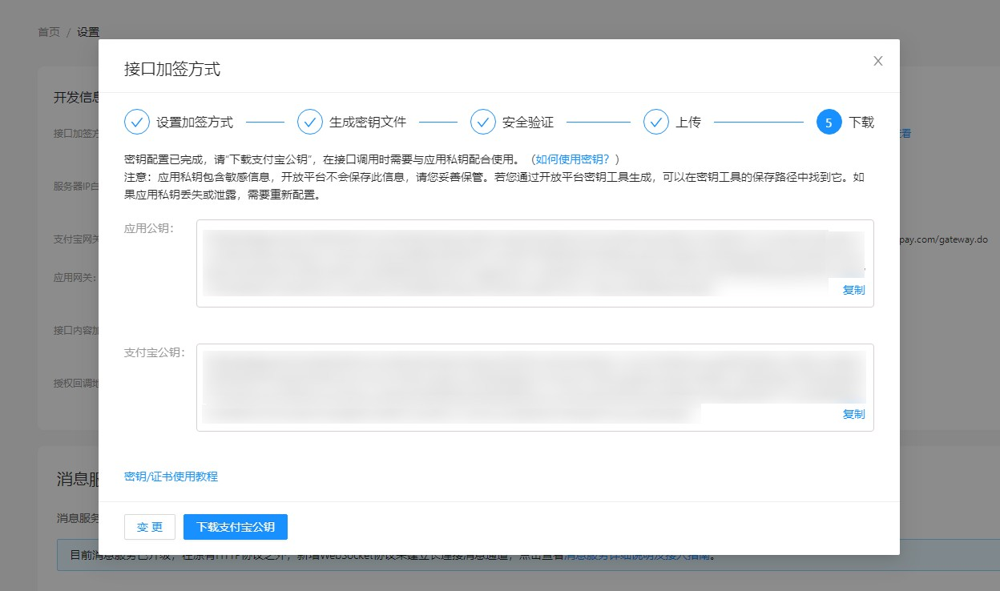
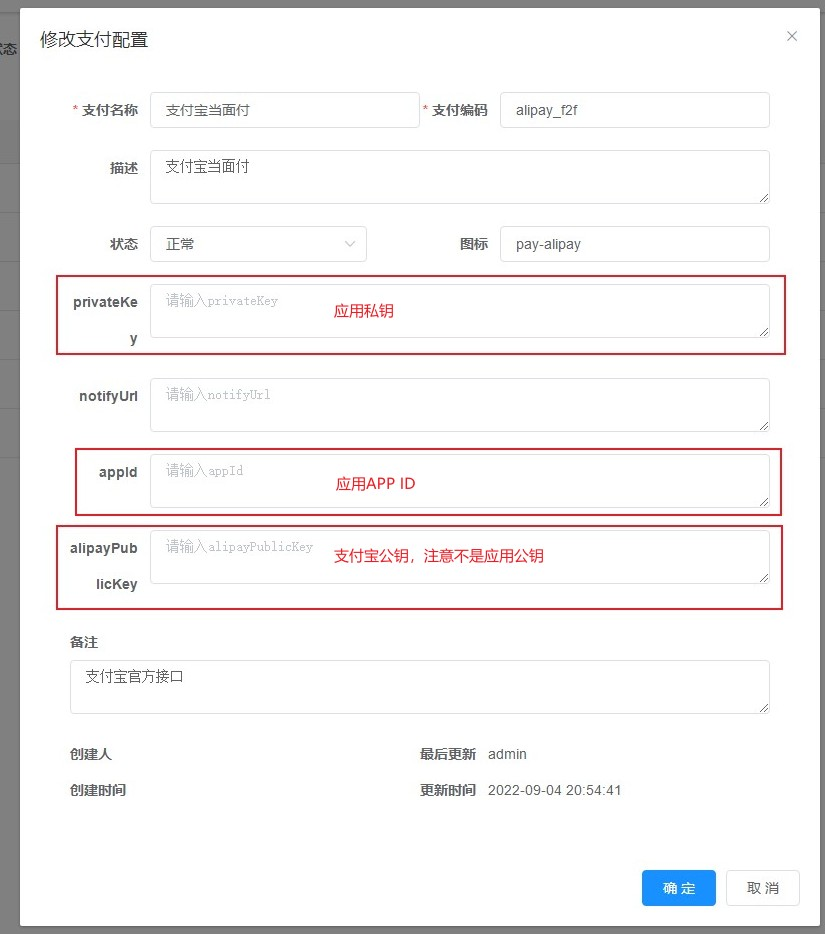

# 支付宝当面付

## 当面付申请条件

**支持的账户类型**：经过实名认证的个人/企业支付宝账号  
**签约申请提交资料**：

1. 经营场所照片  
   a. 有店铺门头的经营场所，需提供门头照  
   b. 无店铺门头的经营场所，需提供内景照或场景照

> 提醒：若未规范提交经营场景照片，商家收款将受限，商家需在30天内补全资料，否则将影响正常收款。

2. 与实名认证的支付宝账号持有人同名的营业执照（即营业执照的法人代表与支付宝账号持有人姓名一致）

> 提醒：若未提供同名营业执照，可长期使用但商家收款有限额。

3. 费率

|服务名称|费率|服务期限|  
|:-:|:-:|:-:|  
|单笔费率|0.6%|1年|

:::tip 说明  
申请当面付其实很简单，只需要找一张店铺门面照片即可，可以到外面随便拍一张，或者网站搜索。  
营业执照是可选的，不上传的话，限制单笔收款≤1000，单日收款≤5W，对于小网站来说，这个额度已经够用了。  
:::

:::tip 补充  
如果你的支付宝账号在申请时，提示风险过高，那就换另一个账号。支付宝的规则系统一般会检测你账号近期的交易，看是否有风险，新注册的支付宝账号，一般都申请不了当面付。  
:::

## 当面付申请流程

> 按以下方法申请当面付费率为0.6，此处提供一种费率为0.38的申请方式，不一定成功，可以一试：参考链接：[https://www.yunyanu.cn/187.html](https://www.yunyanu.cn/187.html)

1. 点击[这里](https://b.alipay.com/signing/productDetailV2.htm?productId=I1011000290000001003)进入，登录支付宝账户，然后点击`立即开通`。  
   

2. 填写基本信息，红色星号的必填：

- 经营内容选择百货`零售批发/超市`，或者选其他的，建议不要选平台类、支付类、游戏类的，这些审查严格，没有企业资质和电信增值许可证是通过不了。
- 营业执照可以不上传。
- 店铺招牌，就是门店的照片，可以去外面拍一张，也可以百度搜索。
- 提交申请后十多分钟就可收到通过通知。  
  

## 当面付生成密钥

### 一、准备工作

1. 首先是要申请成功开发者，可以登录[支付宝开放平台](https://developers.alipay.com/)申请  
   

2.

当面付申请成功后，可以在[蚂蚁金服开放平台](https://open.alipay.com/platform/developerIndex.htm)`网页&移动应用`中，看到我的应用列表中多了一个`应用2.0签约202*******************`的应用，应用名称下方为应用的**APPID**
，后续需要用到  

::: tip 注意 请注意记录此处的`APPID`，后续对接红叶系统需填写此参数
:::

### 二、生成公钥和私钥

1. 密钥工具`支付宝开放平台开发助手`下载并安装  
   [点击此处下载](https://opendocs.alipay.com/common/02kipk?pathHash=0d20b438)

2. 利用 `支付宝开放平台开发助手`
   生成RSA密钥（包括应用公钥和应用私钥），官方教程地址：[第一步：生成密钥并上传 ｜ 网页&移动应用](https://opendocs.alipay.com/common/02kipl?pathHash=84adb0fd)  
   a. 打开`支付宝开放平台开发助手`  
   b. 加签方式选择`密钥`，加密算法选择`RSA2`  
   

c. 点击`生成密钥`，即可自动生成`应用公钥`和`应用私钥`  

::: tip 注意 请注意记录此处的`应用私钥`，后续对接红叶系统需填写此参数
:::

3. 点击进入应用2.0签约202**************，点击`接口加签方式（密钥/证书)：`的`设置`设置应用公钥  
   

把前面生成的应用公钥复制进去，然后保存设置即可，下方会显示出`支付宝公钥`   

::: tip 注意 请注意记录此处的`支付宝公钥`，后续对接红叶系统需填写此参数
:::

:::tip 注意
**应用公钥**与**支付宝公钥**是不同的，在填写时注意区分  
:::

## 对接红叶系统

1. 进入红叶系统后台，打开`系统配置`-`支付配置`，找到`支付宝当面付`，点击右侧`修改`按钮进入配置页面  
   

2. 填写下列参数后保存

> **privateKey**：应用私钥  
> **appId**：应用APPID  
> **alipayPublicKey**：支付宝公钥，注意不是应用公钥

3. 启用该支付方式

4. 测试购卡  
   进入红叶商城，随意选择商品后，选择`支付宝当面付`支付并提交订单，如果可以正常生成付款二维码即配置成功  
