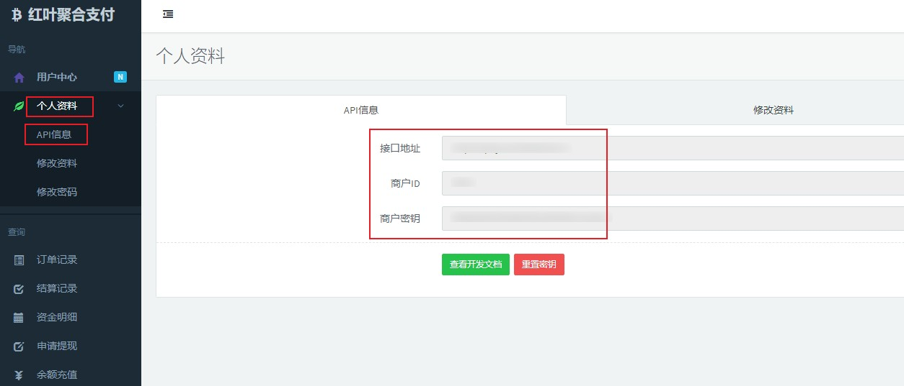
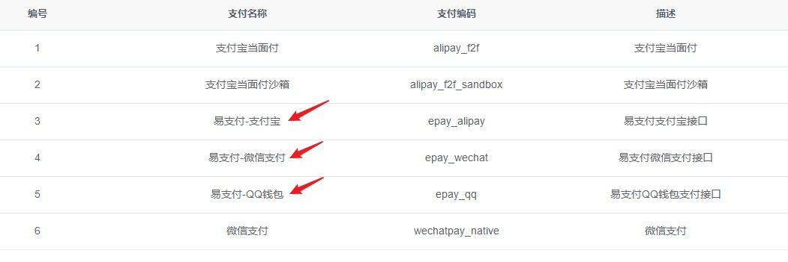
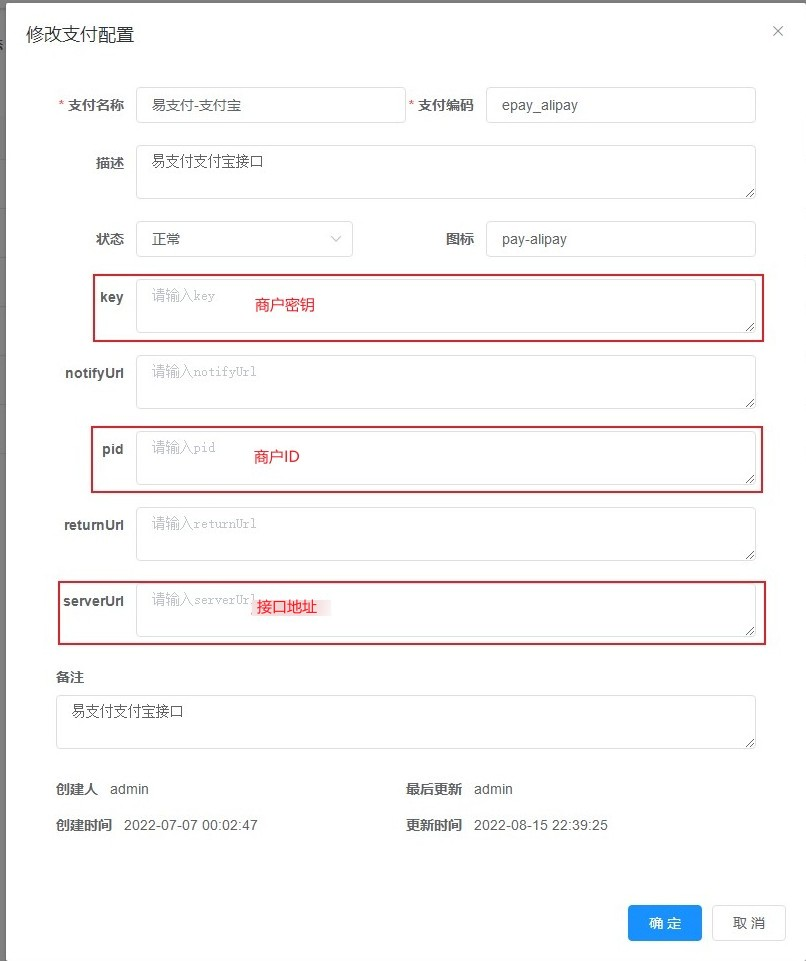

# 易支付/码支付  

## 注册申请易支付  

需要您自行寻找可靠的易支付提供商  

## 获取对接参数  

进入易支付后台，进入`个人资料-API信息`，即可看到`接口地址`、`商户ID`和`商户密钥`
  

## 对接红叶系统  
1. 进入红叶系统后台，打开`系统配置`-`支付配置`，找到`易支付-XXX`(找需要对接的支付方式，可选支付宝/微信/QQ钱包)，点击右侧`修改`按钮进入配置页面  
  

2. 填写下列参数后保存  
> **key**：商户密钥  
> **pid**：商户ID  
> **serverUrl**：接口地址    

  

3. 启用该支付方式  

4. 测试购卡  
进入红叶商城，随意选择商品后，选择`易支付-XXX`支付并提交订单，如果可以正常生成付款二维码即配置成功  