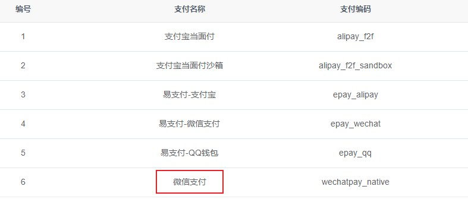

# 微信支付  

> 微信扫码支付是商户系统按微信支付协议生成支付二维码，用户再用微信`扫一扫`完成支付的模式。该模式适用于PC网站支付、实体店单品或订单支付、媒体广告支付等场景  

## 官方文档  
参考官方文档：[https://pay.weixin.qq.com/wiki/doc/apiv3/open/pay/chapter2_7_0.shtml](https://pay.weixin.qq.com/wiki/doc/apiv3/open/pay/chapter2_7_0.shtml)  

## 微信支付申请流程  
1. 第一步：注册公众号（类型须为：服务号）  
请根据营业执照类型选择以下主体注册：个体工商户| 企业/公司| 政府| 媒体| 其他类型。  

2. 第二步：认证公众号   
公众号认证后才可申请微信支付，认证费：300元/年。  

3. 第三步：提交资料申请微信支付  
登录公众平台，点击左侧菜单【微信支付】，开始填写资料等待审核，审核时间为1-5个工作日内。  

4. 第四步：开户成功，登录商户平台进行验证  
资料审核通过后，请登录联系人邮箱查收商户号和密码，并登录商户平台填写财付通备付金打的小额资金数额，完成账户验证。  

5. 第五步：在线签署协议  
本协议为线上电子协议，签署后方可进行交易及资金结算，签署完立即生效。  

## 对接红叶系统  
1. 进入红叶系统后台，打开`系统配置`-`支付配置`，找到`微信支付`，点击右侧`修改`按钮进入配置页面  
  

2. 填写下列参数后保存  
> **appId**：应用APPID，微信公众账号或开放平台APP的唯一标识  
> **mchId**：商户ID，商户号 (配置文件中的partner)  
> **partnerKey**：商户KEY，商户密钥  

::: tip
商户ID和商户KEY在微信商户平台后台：  
1. 登录微信商户平台：[http://pay.weixin.qq.com](http://pay.weixin.qq.com)  
2. 点击`账户中心-个人信息-登录账号`就是商户mchId  
3. 点击`账户中心-API安全-设置密钥`按钮，按照页面的提示进行设置  
:::

  

3. 启用该支付方式  

4. 测试购卡  
进入红叶商城，随意选择商品后，选择`微信支付`支付并提交订单，如果可以正常生成付款二维码即配置成功  