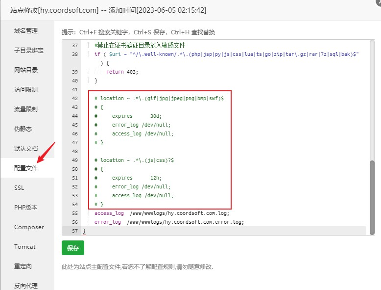

# 常见问题

## 售前相关问题

#### 红叶网络验证的授权是绑定IP还是域名？换绑收费吗？
只绑服务器，IP和域名没限制，可以随意更换，如果后续您需要更换服务器，可免费变更剩余授权到新服务器中，如果迁移数据需要官方技术支持，我们也可提供有偿服务。

#### 可以对接成品软件验证吗？
可以，验证提供安卓成品软件(APK)和电脑成品软件(EXE)接入的功能，最好提供未加密未混淆的程序，能否接入成功要视具体软件而定，您可在演示站中自行尝试。

#### 对接或使用过程中有疑问怎么办？
可查阅官方文档或随时在官方群里提问，如果购买了本系统授权，可联系群管理进入VIP群，在VIP群中提问会得到优先解答。

#### 红叶验证收费吗？除了授权费，还有其他的费用吗？
需要购买系统授权才可以使用，除了授权费没有任何其他收费。

#### 是否提供服务器呢?
红叶不提供服务器，您可选择在腾讯云、阿里云、华为云等云服务器厂商处购买。

:::tip
国内服务器如果需要使用商城/发卡等功能，需要备案和申请许可，否则可能被运营商中断服务。  
建议：1、不要使用www域名，2、不要使用80端口
:::

#### 其他验证系统的卡密可以导入吗？
支持外部卡密批量导入。

#### 红叶是本地验证还是网络验证？
红叶系统是网络验证，但系统本身的授权是本地验证，即使有一天我们不再提供服务，您购买的验证也不会受到丝毫影响。

#### 支持一个卡密多个设备同时使用吗？
支持，可自定义同一卡密在线数量。设置路径：验证管理-软件管理-限开设置。

#### 限制软件、卡类、卡密、用户数量吗？
不限制。

## 搭建相关问题

#### 红叶网络验证是需要使用自己的服务器搭建吗？
是的，我们只提供服务端程序，需要部署在您自己的服务器上，如果统一使用官方的服务器，一但服务器被攻击，那么所有软件用户都会受到影响，而且用户数据掌握在自己手里更加安心。

#### 数据库名可以不叫hywlyz吗？
可以。

#### 不会/不想自己搭建，有搭建服务吗？
可选择有偿搭建服务。

#### 必须有域名吗？
没有域名也可以，如果您不想买域名，可以直接使用IP地址。

## 对接相关问题

#### 有对接例子吗？
目前我们提供了易语言、按键精灵(安卓)、懒人精灵、火山PC等多种语言的SDK和对接例程，可在官方群共享下载，更多例程也在逐步增加中。

#### 一键注入在哪里操作，支持哪些软件/系统？
登录系统后台，验证管理-软件管理-版本管理-快速接入，目前支持安卓（apk）和Windows（exe）软件。

#### 单例注入的Activity和Method应该如何选择？
这个没有固定的选项，Activity和Method列表中所列出的内容为红叶根据您上传的APK自动识别出来的，需要您自行尝试。凭以往的经验，Activity一般选包含MainActivity的，Method一般选择onCreate。  

以下是一些使用特定开发工具开发的APK的选择方式：  

:::: code-group
::: code-group-item 按键精灵
```
全局模式  
单例模式：com.ds.daisi.activity.ElfinPayActivity、onCreate 
```
:::
::: code-group-item AutoJS（Pro）
```
单例模式：com.stardust.autojs.inrt.SplashActivity、onCreate  
单例模式：com.stardust.autojs.execution.ScriptExecuteActivity、runScript 
```
:::
:::: 

#### 系统提示“JSON parse error”，是什么问题？
请检查软件客户端对接参数与后台设置是否一致，重点检查**加解密算法**

#### 怎么让2个软件的卡通用呢?
验证后台不同的软件不支持卡密通用，但是您可以将您的不同的软件对接到验证后台的同一个软件中来实现卡密通用。

#### 一键加验证支持加壳的程序不？
有壳的成功率很低，压缩壳也许可以，请自行尝试。

## 功能相关问题

#### 登录用户限制和登录机器数限制是软件下所有的用户和设备一起计算吗？
不是，每个账号/单码独立限制。

#### 卡类能否添加自定义字段？
可以，在设置卡类时可通过设置`自定义参数`来为对应卡密添加自定义字段，在批量制卡时，该字段会被原封不动地赋值到卡密中，如果用户使用带有自定义字段的卡密登录或充值，可通过调用`软件用户信息API`获取到该自定义字段的值。

#### 商城页面可以自定义吗？
公告信息、上架商品、导航项和指定默认首页都可以在后台进行设置。

#### 怎么给全部用户补时间?
可通过`批量操作`功能为用户批量增加时间，注意：如果用户未过期将在用户过期时间基础上进行增加时间，如果用户已过期，将在当前实际时间基础上进行增加时间。

#### 软件的数据加密方式变更，注入的APP是否要重新注入？
需要重新注入，之前注入的软件将无法正常使用。

#### 版本管理中下载地址和下载地址(直链)有什么区别？
“下载地址”是指需要跳转的网页地址，比如蓝奏云、百度云盘的下载页面；“下载地址(直链)”是指程序的直链地址。如果您使用了安卓软件(APK)的快速接入功能，在升级版本时下载地址和下载地址(直链)至少要提供一个，当仅提供下载地址时，软件会使用浏览器打开下载地址，当提供直链地址时，软件将直接下载新版本并启动安装，如果两者同时提供，直链地址生效。

#### 安卓软件(APK)如何获取和校验软件的MD5？
MD5校验是提供给电脑(EXE)软件的一项安全功能，安卓软件(APK)不支持此功能。

#### 系统限制最短卡密长度为10位，如何生成更短位数的卡密？
生成规则选自定义，自定义不受卡密长度参数限制。举例：7位大小写字母数字随机可填写规则如下：
```
[a-zA-Z0-9]{7}
```

#### 自动更新时后台会中断服务吗？
更新完毕后验证系统会自动重启，所有功能将会暂停约2-3分钟，可能造成部分软件用户连接异常或掉线，建议在非高峰时段进行更新。

#### 多开数有多个地方可以设置，是以哪个设置为准？
多开数在卡密管理/单码管理、软件用户、软件管理三个地方均可配置，配置生效优先级为：卡密>用户>软件

#### 计时模式用户过期了/后台踢掉用户后软件为什么没有立刻退出？
软件会在一个心跳周期内响应动作，即用户到期后最多可继续使用您的软件一个心跳周期的时间，心跳周期可在后台软件配置中设置，最短可设置为30秒。

#### 前台的商城可以关闭吗？
可以，在系统配置-网站设置中将`是否开启前台`设置为`否`。

## 系统错误问题

#### 系统提示“您的授权证书无效，请核查服务器是否取得授权或重新申请证书！”怎么办？
您未购买授权或已有授权已过期，购买授权后即可正常使用。

#### 系统提示“系统接口502异常”，是什么问题？
验证后台程序未启动，启动方式如下：  
:::: code-group
::: code-group-item Linux-CentOs
```
服务器终端中输入以下命令启动后端程序（注意其中的/opt/app/hywlyz使用自己的实际路径）
cd /opt/app/hywlyz && sh hy.sh restart && tail -f nohup.out
```
:::
::: code-group-item Windows
```
双击安装目录下hy.bat即可启动后端程序
```
:::
::::

#### 后台密码忘了怎么找回？
登录数据库找到`sys_user`数据表把`admin`密码换成`$2a$10$UwUkJKuTnMupk0B/9Puwj.ZegnPxFf8KZoYHrwGCkMJn/VSJT1wFa`，`admin`的密码会被重置为默认密码`admin123`

#### 网站上传logo、favicon等图片无法显示/网站css、js请求失败，该如何处理？
进入宝塔后台，点击左侧菜单`网站`，找到红叶，点击右侧`设置`-`配置文件`，将下图所框选内容注释掉即可。


## 支付相关问题

#### 第三方支付接口，比如易支付是需要自己找吗？
是的，红叶只提供支付对接接口，不提供支付服务。

#### 码支付可以使用吗？
可以，使用易支付接口对接，兼容码支付。