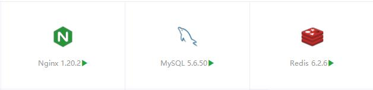
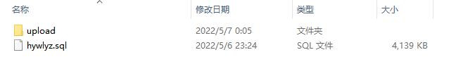
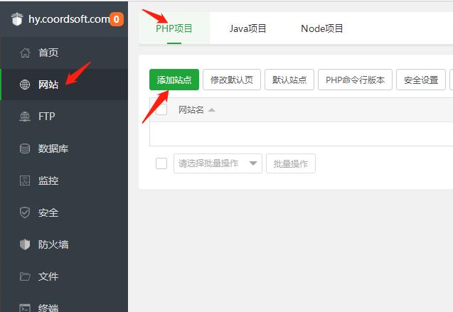
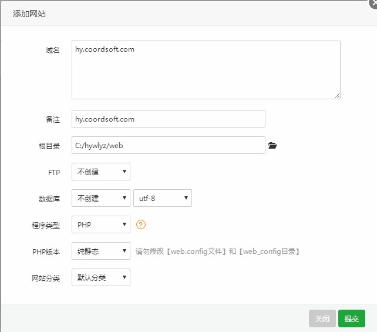
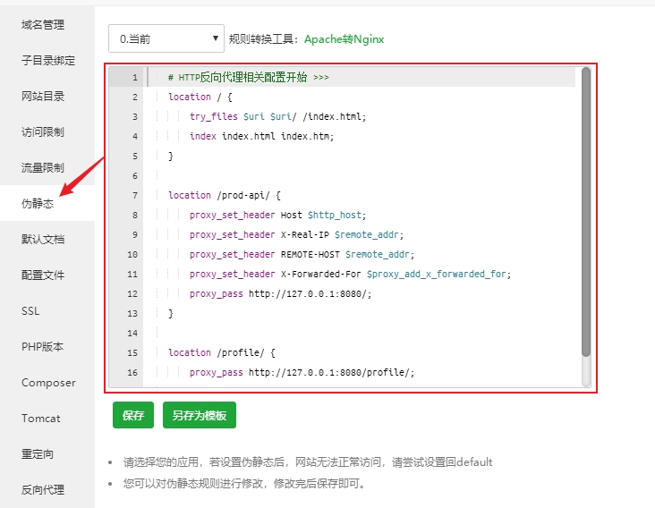
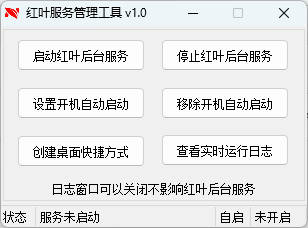

# 宝塔面板部署文档

## 一、准备工作

### 1、软件下载
请加入红叶验证官方群下载最新版本软件包：[947144396](https://jq.qq.com/?_wv=1027&k=I2MM7JLa)

### 2、安装环境
部署本验证系统需要用户自备服务器，Windows/Linux均可，推荐使用Centos服务器，本教程将以WindowsServer2012R2为例进行演示，服务器需安装以下环境：

```
1. JDK >= 1.8 (推荐1.8版本)
2. Mysql >= 5.7.0 (推荐5.7版本)
3. Redis >= 5.0 (推荐7.0版本)
4. Nginx >= 1.20.0
```

:::tip
为了简化安装步骤，接下来的步骤将使用宝塔面板安装
宝塔面板下载地址：[https://www.bt.cn/new/download.html](https://www.bt.cn/new/download.html)
:::

#### （1）Java环境：JDK
在群共享下载JDK安装包`jdk-8u301-windows-x64.exe`并安装即可  
安装完毕后按`win+r`打开运行对话框，输入`cmd`并回车，在弹出的命令框中输入如下命令
```
java -version
```
输出类似下方文字代表安装成功
```
C:\Users\Administrator>java -version
java version "1.8.0_301"
Java(TM) SE Runtime Environment (build 1.8.0_301-b09)
Java HotSpot(TM) 64-Bit Server VM (build 25.301-b09, mixed mode)

C:\Users\Administrator>
```
#### （2）Mysql/Redis/Nginx
Mysql、Redis、Nginx这三个软件可以在宝塔面板软件商店里直接搜索安装，安装完毕如图所示


#### （3）新建数据库
##### 1、在安装好的Mysql数据库中新建数据库`hywlyz`，数据库编码选择`utf8mb4`，如图所示：


##### 2、解压程序压缩包
解压下载的红叶验证程序压缩包，如图：
  
将解压出来的`hywlyz.sql`文件导入到刚创建的数据库中

## 二、部署程序
### 1、上传程序到服务器
将`upload`文件夹的内容上传到服务器，此处上传到`C:/hywlyz`目录为例，后文中出现的此路径均应修改为您使用的路径（建议您使用此路径，后续文中需修改安装路径的指令可无需修改直接复制粘贴）

### 2、修改配置文件
#### （1）修改数据库密码
编辑`application-config.yml`，将`数据库密码`更改为您的数据库密码，此处请注意`jdbc:mysql://127.0.0.1:3306/hywlyz?useUnicode=`中的`hywlyz`为数据库名，若与您不一致请注意修改

```{6-8}
# 数据源配置
  datasource:
    druid:
      # 主库数据源
      master:
        url: jdbc:mysql://127.0.0.1:3306/hywlyz?useUnicode=true&characterEncoding=utf8&zeroDateTimeBehavior=convertToNull&useSSL=true&serverTimezone=GMT%2B8&allowMultiQueries=true
        username: hywlyz
        password: <数据库密码>
```
#### （2）修改Redis密码
::: tip
如果您是刚安装的Redis，默认是没有密码的，此处无需修改，请忽略此步骤
:::
如果配置了Redis数据库密码，需要将`Redis密码`处更改为您的密码（如果您未配置过Redis密码，默认密码为空，此处无需修改）
```{8}
# redis 配置
  redis:
    # 地址
    host: 127.0.0.1
    # 端口，默认为6379
    port: 6379
    # 密码
    password: <Redis密码>
```

### 3、启动前端程序
在宝塔面板依次选择`网站`-`PHP项目`-`添加站点`  


域名：填写您自己的域名，此处以`hy.coordsoft.com`为例  
根目录：选择上传的程序包中的`web`目录  
PHP版本：选择`纯静态`  
  
创建完毕后点击网站的`设置`，打开`站点修改`页面，选择`伪静态`  
  
将以下规则填写到右侧框中
```
# HTTP反向代理相关配置开始 >>>
location / {
    try_files $uri $uri/ /index.html;
    index index.html index.htm;
}

location /prod-api/ {
    proxy_set_header Host $http_host;
    proxy_set_header X-Real-IP $remote_addr;
    proxy_set_header REMOTE-HOST $remote_addr;
    proxy_set_header X-Forwarded-For $proxy_add_x_forwarded_for;
    proxy_pass http://127.0.0.1:8080/;
}

location /profile/ {
    proxy_pass http://127.0.0.1:8080/profile/;
}
# HTTP反向代理相关配置结束 <<<
```

### 4、启动后端程序
双击`hy.bat`文件即可启动程序  

::: tip 更多操作
双击打开`红叶服务管理工具`可进行更多操作  

:::

如果出现以下提示代表启动成功


:::tip
`设备码`为您服务器的唯一标识，若果您是内网环境搭建，需要凭此码获取授权信息（未获得授权时在管理员登录页尝试登录也会弹出此设备码）

:::

此时即可通过您的域名尝试访问网站`http://域名/admin`，默认管理员账号密码为：admin/admin123，如果登录时提示未授权说明部署成功，如果提示后端连接异常，请检查上述步骤，并重新启动后端程序

## 三、设置开机启动
双击打开`红叶服务管理工具`，点击`设置开机自动启动`即可  


## 四、购买授权
购买请访问商城：[https://shop.coordsoft.com/](https://shop.coordsoft.com/)
购买授权码后点击 [激活授权](https://shop.coordsoft.com/getLicense) 为您的网站在线授权

## 五、登录网站
至此，整个网站部署完成，如果一切正常，您可通过您的域名访问属于您的红叶网络验证系统  
前台地址：http://域名  
后台地址：http://域名/admin  
默认管理员账号密码：admin/admin123

:::tip
首次进入后台，系统会提示请配置网站域名，请点击确认并打开`系统配置`-`网站配置`菜单页，将默认信息修改为您的信息，其中`网站域名`必须修改为您的实际访问域名(或IP)

:::